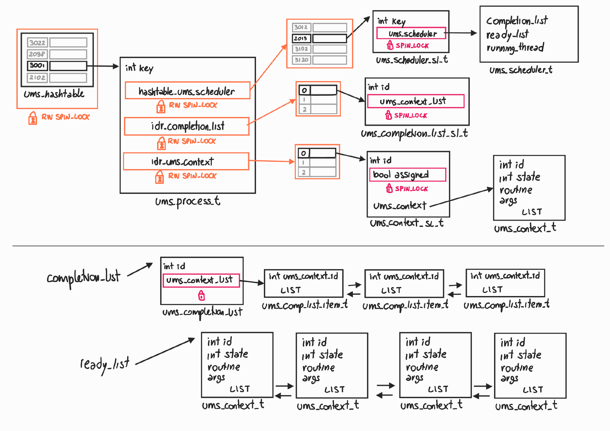

# AOSV Final Project Report

_A.Y. 2020/2021_

Author: Gioele Migno (1795826) 

# Introduction

The project deals with the implementation of a Linux Kernel Module (LKM) able to provide User Mode Scheduling (UMS), namely a feature that allows the user to schedule by himself threads in a process. 

Linux Kernel doesn't allow to easily add new syscalls using a LKM, therefore this module has been developed as a generic virtual device (i.e miscellaneous device at /dev/ums), in this way, all the services needed to the user are provided through ioctl system call that can be freely managed by a module.

> This module has been developed and tested on Linux 5.13.0-28-generic

## UMS Data Structures

In this section the key components of UMS LKM are introduced using a down-up approach.

### UMS_context

This object represents a thread that could be in run/idle mode, ended or not created yet. Its principal components are an identifier (*id*), state (*state*), pointer to the user routine (*routine*) and routine's arguments (*args*).

```c
typedef struct ums_context_t{
    ...
    int id; /** descriptor */
    ...
    int state; /** state of the ums_context: 
                    UMS_THREAD_STATE_IDLE, 
                    UMS_THREAD_STATE_RUNNING, 
                    UMS_THREAD_STATE_ENDED*/

    void* (*routine)(void* args);   /** routine of the user */
    void* args; /** args of user's routine */
    ...
}ums_context_t;
```

A ums_context can be shared between several scheduler threads, therefore in order to protect it during a parallel access, another object is used called ums_context_sl, where "sl" stands for spin_lock

```c
typedef struct ums_context_sl_t{
    int id; /** descriptor, the same of the ums_context managed*/

    bool assigned; /** (IN USE) indicates that the managed ums_context has been already assigned to another scheduler*/
    spinlock_t assigned_spin_lock; /** used to protect "assigned" field */

    ums_context_t* ums_context; /** pointer to the ums_context managed*/
}ums_context_sl_t;
```

### UMS_completion_list

A ums_completion_list is a list of ums_context's IDs that have to be executed by a ums_scheduler. The same ums_completion_list can be shared between several ums_schedulers, for this reason, a ums_completion_list is managed through an object called ums_completion_list_sl, in charge of managing possible parallel access. 

As a ums_context, also a ums_completiond_list_sl has an ID.

```c
typedef struct ums_completion_list_sl_t{
    int id; /** descriptor */

    spinlock_t ums_context_list_spin_lock;  /** used to protect the ums_completion_list */
    struct list_head ums_context_list;  /** ums_completion_list */
}ums_completion_list_sl_t;
```

The field *ums_context_list* represents the actual ums_completion_list, in which each element is a ums_completion_list_item object:

```c
typedef struct ums_completion_list_item_t{
    ...
    int ums_context_id;    /** id of a ums_context */ 
}ums_completion_list_item_t;
```

### UMS_scheduler

As previously mentioned, a ums_completion_list is managed by one or more ums_schedulers, a ums_scheduler represents a thread used as scheduler. At each scheduler call, a user defined function, called entry_point, is executed:

```c
void entry_point(entry_point_args_t* entry_point_args);
```

```c
typedef struct entry_point_args_t{
    reason_t reason; /** reason of the scheduler call:
                        REASON_STARTUP
                        REASON_THREAD_YIELD
                        REASON_THREAD_ENDED */
    ums_context_descriptor_t activation_payload;    /** if reason is yielded or ended thread, 
                                                    indicates the descriptor of the ums_context */
    void* sched_args;   /** user defined scheduler arguments */
}entry_point_args_t;
```

In the same way as a ums_completion_list, also a ums_scheduler is managed by another object called ums_scheduler_sl.

In this case, a ums_scheduler is identified through its pid, instead of a generic ID (*key*).

```c
typedef struct ums_scheduler_t{
    ...
    ums_completion_list_sl_t* completion_list; /** ums_completion_list managed */
    ...
    struct list_head ready_list;    /** ready list of the scheduler */
    ...
    ums_context_t* running_thread; /** pointer to the current ums_context in execution*/
    ...
}ums_scheduler_t;
```

```c
typedef struct ums_scheduler_sl_t{
    ...
    int key; /** key in the hashtable, corresponds to scheduler's pid*/

    spinlock_t ums_scheduler_spin_lock; /** protect ums_scheduler */
    ums_scheduler_t* ums_scheduler; /** pointer to the scheduler to protect */
    ...
}ums_scheduler_sl_t;
```

#### How a thread is scheduled

A ums_scheduler is able to schedule its threads by changing their state. When the scheduler executes a thread, it sets the thread's state to TASK_RUNNING and sets its own state to TASK_INTERRUPTIBLE. 

```c
static inline int rq_execute_next_ready_thread(rq_execute_next_ready_thread_args_t* rq_args){
    ...
    ums_scheduler->num_switch += 1;
    ums_scheduler->running_thread = ums_context;    
    ums_context->state = UMS_THREAD_STATE_RUNNING;

    while(!wake_up_process(ums_context->task_struct));
    ...
}
```

```c
static inline int rq_wait_next_scheduler_call(rq_wait_next_scheduler_call_args_t* rq_args){
    ...
    set_current_state(TASK_INTERRUPTIBLE);
    schedule();
    ...
}
```

The scheduler will be woken up when a ums_context yields or ends.

```c
static inline int rq_end_thread(rq_end_thread_args_t* rq_args){
    ...
    sched_ts = ums_scheduler->scheduler_task_struct;
    ...
    while(!wake_up_process(sched_ts));
    schedule();
    ...
}
```

### UMS_process

A ums_process represents a Linux process that manages its threads by using the UMS LKM. A ums_process stores all the previous kind of objects that belong to a single process.

Ums_process stores all of its objects in several data structures, each of them allows to get an object in O(1) cost.

Ums_contexts and ums_completion_list_sl are stored using a simple ID allocation based on the Linux IDR implementation. Ums_schedulers instead, since they are identified by their pids, are stored in a hash table, created using the Linux implementation. All of these data structures are protected by a read-write spinlock.

```c
typedef struct ums_process_t{
    ...
    int key; /** key in the ums_hashtable (equals to tgid (thread id)) */

    DECLARE_HASHTABLE(hashtable_ums_schedulers, HASHTABLE_UMS_SCHEDULERS_HASH_BITS);    /** hashtable that contains schedulers, the key of as scheduler is its pid*/  
    rwlock_t hashtable_ums_schedulers_rwlock; /** rw_spin_lock of ums_scheduler_hashtable */
    ...
    struct idr idr_completion_list;  /** idr struct used to allocate the ums_completion_lists managed by this process*/
    rwlock_t idr_completion_list_rwlock;    /** rw_spin_lock of idr_completion_list */

    struct idr idr_ums_context;  /** idr struct used to store ums_contexts managed by this process*/
    rwlock_t idr_ums_context_rwlock;    /** rw_spin_lock of idr_ums_context */
    ...
}ums_process_t;
```

### UMS_hashtable

All the ums_process are stored in a global hash table called ums_hashtable that uses the thread group identifier (tgid) of the processes as key.

### Overall Structure

The overall data structure managed by the UMS LKM is the following one:



# /proc

This module exposes several information in the /proc filesystem

`/proc/ums/<tgid>/schedulers/<pid_scheduler>` contains a file called *info* that exposes info about the scheduler:

```bash
> gio@gio-VirtualBox:/proc/ums/176253/schedulers/176254$ cat info
    ns=1         #num of switches
    cl=2         #elements in completion list
    rl=-         #empty ready_list
    run=1        #id of the thread in execution
```

`/proc/ums/<tgid>/schedulers/<pid_scheduler>/workers` contains a file for each ums_context managed

```bash
> gio@gio-VirtualBox:/proc/ums/178676/schedulers/178677/workers$ ls
    1  2

> gio@gio-VirtualBox:/proc/ums/178676/schedulers/178677/workers$ cat 1
    ns=2                        # num of switches
    state=idle                  # status
    ums_run_time=30036          # ums run time in milliseconds
```

# User Interface

In this section, the functions available to the user are briefly introduced. 

```c
//init/remove ums mode
res_t ums_init(void);
res_t ums_destroy(void);
```

```c
// create/delete a ums_context
res_t create_ums_context(ums_context_descriptor_t* descriptor,void* (*routine)(void*), void* args, void* user_res);
res_t delete_ums_context(ums_context_descriptor_t descriptor);
```

```c
// create/delete a ums_completion_list
res_t create_ums_completion_list(ums_completion_list_descriptor_t* ums_completion_list_descriptor);
res_t delete_ums_completion_list(ums_completion_list_descriptor_t ums_completion_list_descriptor);
```

```c
// add/remove a ums_context from a ums_completion_list
res_t completion_list_add_ums_context(ums_completion_list_descriptor_t completion_list_d, ums_context_descriptor_t ums_context_d);
res_t completion_list_remove_ums_context(ums_completion_list_descriptor_t completion_list_d, ums_context_descriptor_t ums_context_d);
```

```c
// create a ums_scheduler
res_t create_ums_scheduler(ums_scheduler_descriptor_t* sd, ums_completion_list_descriptor_t cd, void(*entry_point)(entry_point_args_t* entry_point_args), void* sched_args, int cpu_core);
```

```c
// exit() function for the scheduler
void exit_scheduler(int return_value);
```

```c
// Execute the next ums_context in the ums_completion_list of the scheduler
res_t execute_next_new_thread(void);
```

```c
// Execute the next ums_context in the ready_list of the scheduler
res_t execute_next_ready_thread(void);
```

```c
//join scheduler thread
res_t join_scheduler(ums_scheduler_descriptor_t* usd, int* return_value);
```

```c
// current ums_context in execution leaves the control to the scheduler
res_t yield(void);
```

```c
// get some ums contexts from the completion_list of the scheduler
res_t get_ums_contexts_from_cl(info_ums_context_t* array_info_ums_context, size_t array_size);

// get some ums contexts from the ready_list of the scheduler
res_t get_ums_contexts_from_rl(info_ums_context_t* array_info_ums_context, size_t array_size);

//execute a ums_context identified by a pointer to a info_ums_context_t
res_t execute(info_ums_context_t* info_ums_context);
```

> For more info, please refer to the complete documentation available in `/doc/refman.pdf` 

# Results

Let's introduce now two examples of a program that uses the UMS module

## Example 1

### Code

In this first example there are three ums_contexts, they share the same user routine, but the arguments passed are different, indeed each ums_context will print its own descriptor. Each ums_context yields after the third print.

```c
void* routine(void* args){
    int value = *((int*) args);
    int i;
    for(i=0; i<5; i++){
        printf("Hello world!---%d---\n", value);
        sleep(1);
        if(i==2){
            printf("YIELD\n");
            yield();
        }
    }
    return NULL;
}
```

UMS library allows to assigned a user defined variable to each ums_context in order to store information about it, in this example, the following struct is assigned to each i-th thread:

```c
// i = [0,1,2]
ums_context_descriptor_t ucd_0;
int value_i = i;
my_info_t info_i = {
    .prio = 4-i
};

create_ums_context(&ucd_0, &routine, &value_i, &info_i);
```

Main:

```c
int main(int argc, char **argv){
    int ret;
    ums_init();
    ...
    ums_completion_list_descriptor_t uld_0;
    create_ums_completion_list(&uld_0);
    completion_list_add_ums_context(uld_0, ucd_i); // i = [0, 1, 2]
    ...
    ums_scheduler_descriptor_t sd_0;
    create_ums_scheduler(&sd_0, uld_0, entry_point, NULL, -1);
    join_scheduler(&sd_0, &ret);
    printf("ret sched = %d\n", ret);
    ...    
    ums_destroy();
    return EXIT_SUCCESS;
}
```

The entry_point function starts sequentially all the threads in the completion_list, following the order in the list. When the ums_completion_list is empty, it executes all the threads in the ready list by choosing at first the thread with higher priority (lower value).

```c
void entry_point(entry_point_args_t* entry_point_args){
    int res;
    info_ums_context_t info_ums_context[5];
    info_ums_context_t* iuc_to_exec;
    my_info_t* my_info;

    int best_prio;
    int best_id;

    switch(entry_point_args->reason){
        case REASON_STARTUP:
            printf("Startup\n");

            res = get_ums_contexts_from_cl(info_ums_context, 5);
            if(res > 0){
                for(int i=0; i<res; i++){
                    my_info = info_ums_context[i].user_reserved;
                    printf("cl : info: id=%d "
                                        "time%u," 
                                        "ns=%d, "
                                        "user=%d"
                                        "\n"
                                        , 
                                        info_ums_context[i].ucd,
                                        info_ums_context[i].run_time_ms, 
                                        info_ums_context[i].number_switch, 
                                        my_info->prio);
                }
                iuc_to_exec = &(info_ums_context[0]);
                res = execute(iuc_to_exec);
                if(res == -1){
                    if(errno==ERR_ASSIGNED){
                        printf("ums context already assigned, I will try the next one\n");
                        res = execute_next_new_thread();
                        if(res == -1){
                            printf("error during execute_next_new_thread(). Exit\n");
                            exit_scheduler(EXIT_FAILURE);
                        }
                   }
                   else{
                       printf("unexpected errno=%d\n", errno);
                       exit_scheduler(EXIT_FAILURE);
                   }
                }
            }
            else{
                printf("empty completion list at startup. Exit\n");
                exit_scheduler(EXIT_FAILURE);
            }
        break;

        default:
            printf("Thread yielded or ended UCD=%d\n", entry_point_args->activation_payload);

           res = execute_next_new_thread();
            if(res == -1){
                if(errno == ERR_EMPTY_COMP_LIST){
                    printf("%s(): REASON_THREAD_YIELDED --- empty completion list\n", __func__);
                    res = get_ums_contexts_from_rl(info_ums_context, 5);
                    if(res > 0){
                        best_prio = 99;
                        best_id = -1;

                        for(int i=0; i<res; i++){
                            my_info = (my_info_t*) info_ums_context[i].user_reserved;

                            printf("rl : info: id=%d"
                                                "time%u," 
                                                "ns=%d, "
                                                "user=%d"
                                                "\n"
                                                , 
                                                info_ums_context[i].ucd,
                                                info_ums_context[i].run_time_ms, 
                                                info_ums_context[i].number_switch, 
                                                my_info->prio);

                            if(my_info->prio < best_prio){
                                best_prio = my_info->prio;
                                best_id = info_ums_context[i].ucd;
                            }
                        }
                        printf("chosen %d\n", best_id);
                        iuc_to_exec = &(info_ums_context[best_id]);
                        res = execute(iuc_to_exec);
                        if(res == -1){
                            printf("unexpected errno=%d\n", errno);
                            exit_scheduler(EXIT_FAILURE);
                        }
                    }
                    else if(errno == ERR_EMPTY_READY_LIST){
                        printf("ready list ended\n");
                        exit_scheduler(0);
                    }
                    else{
                        printf("unexpected errno=%d\n", errno);
                        exit_scheduler(EXIT_FAILURE);
                    }
                }
                else{
                    printf("unexpected errno=%d\n", errno);
                    exit_scheduler(EXIT_FAILURE);
                }
            }            
        break;
    }
}
```

> see complete source code at *UMS_Test/main_1.c*

### Execution

```bash
> gio@gio-VirtualBox:~/Documents/final-project-gioele-migno/src/UMS_Test$ make 1 && ./main 
    Startup
    cl : info: id=0 time=0,ns=0, user=4
    cl : info: id=1 time=0,ns=0, user=3
    cl : info: id=2 time=0,ns=0, user=2
    new thread 
    ucd=0, routine=565410e8a2e9 args=565410e8e02c
    Hello world!---0---
    Hello world!---0---
    Hello world!---0---
    YIELD
    Thread yielded or ended UCD=0
    Hello world!---1---
    Hello world!---1---
    Hello world!---1---
    YIELD
    Thread yielded or ended UCD=1
    Hello world!---2---
    Hello world!---2---
    Hello world!---2---
    YIELD
    Thread yielded or ended UCD=2
    entry_point(): REASON_THREAD_YIELDED --- empty completion list
    rl : info: id=0 time=3064,ns=2, user=4
    rl : info: id=1 time=3008,ns=2, user=3
    rl : info: id=2 time=3096,ns=2, user=2
    chosen 2
    from ready
    Hello world!---2---
    Hello world!---2---
    Thread yielded or ended UCD=2
    entry_point(): REASON_THREAD_YIELDED --- empty completion list
    rl : info: id=0 time=3064,ns=2, user=4
    rl : info: id=1 time=3008,ns=2, user=3
    chosen 1
    from ready
    Hello world!---1---
    Hello world!---1---
    Thread yielded or ended UCD=1
    entry_point(): REASON_THREAD_YIELDED --- empty completion list
    rl : info: id=0 time=3064,ns=2, user=4
    chosen 0
    from ready
    Hello world!---0---
    Hello world!---0---
    Thread yielded or ended UCD=0
    entry_point(): REASON_THREAD_YIELDED --- empty completion list
    ready list ended
    ret sched = 0
```

## Example 2

In the second example, there are five ums_contexts and two ums_schedulers, these schedulers share the first ums_context.

> see source code at *UMS_Test/main_2.c*

### Execution

```bash
> gio@gio-VirtualBox:~/Documents/final-project-gioele-migno/src/UMS_Test$ make 2 && ./main 
    new scheduler at cpu0
    new scheduler at cpu1
    CORE0 - Startup
    new thread at cpu0
    CORE1 - Startup
    new thread at cpu1
    CORE0 - Hello world!---0---
    CORE1 - Hello world!---3---
    CORE0 - Hello world!---0---
    CORE1 - Hello world!---3---
    CORE0 - Hello world!---0---
    CORE1 - Hello world!---3---
    CORE1 - YIELD
    CORE1 - Thread yielded UCD=3
    new thread at cpu1
    CORE1 - Hello world!---4---
    CORE0 - YIELD
    CORE0 - Thread yielded UCD=0
    new thread at cpu0
    CORE0 - Hello world!---1---
    CORE0 - Hello world!---1---
    CORE1 - Hello world!---4---
    CORE1 - Hello world!---4---
    CORE0 - Hello world!---1---
    CORE1 - YIELD
    CORE1 - Thread yielded UCD=4
    CORE1 - entry_point(): REASON_THREAD_YIELDED --- empty completion list
    CORE1 - Hello world!---3---
    CORE0 - YIELD
    CORE0 - Thread yielded UCD=1
    new thread at cpu0
    CORE0 - Hello world!---2---
    CORE1 - Hello world!---3---
    CORE0 - Hello world!---2---
    CORE1 - Thread_ended UCD=3
    CORE1 - entry_point(): REASON_THREAD_ENDED --- empty completion list
    CORE1 - Hello world!---4---
    CORE0 - Hello world!---2---
    CORE1 - Hello world!---4---
    CORE0 - YIELD
    CORE0 - Thread yielded UCD=2
    CORE0 - entry_point(): REASON_THREAD_YIELDED --- empty completion list
    CORE0 - Hello world!---0---
    CORE1 - Thread_ended UCD=4
    CORE1 - entry_point(): REASON_THREAD_ENDED --- empty completion list
    CORE1 - ended ready list: BYE!
    CORE0 - Hello world!---0---
    CORE0 - Thread_ended UCD=0
    CORE0 - entry_point(): REASON_THREAD_ENDED --- empty completion list
    CORE0 - Hello world!---1---
    CORE0 - Hello world!---1---
    CORE0 - Thread_ended UCD=1
    CORE0 - entry_point(): REASON_THREAD_ENDED --- empty completion list
    CORE0 - Hello world!---2---
    CORE0 - Hello world!---2---
    CORE0 - Thread_ended UCD=2
    CORE0 - entry_point(): REASON_THREAD_ENDED --- empty completion list
    CORE0 - ended ready list: BYE!
    ret sched = 0
    ret sched = 0
```

# Conclusions

In this project, a LKM able to provide user mode scheduling, has been developed. This module has been implemented using a miscellaneous device mounted at /dev/ums, all the services are provided through ioctl system call. The user can use this module using a library that provides easy to use wrapper functions. The scheduling of the threads is implemented by manipulating their state (TASK_INTERRUPTIBLE / TASK_RUNNING).  
